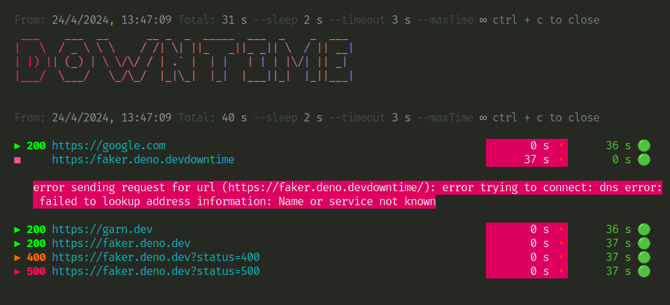

# Downtime

A CLI tool to mesure the downtime of multiples websites in realtime.

Any response status code is considered as a uptime. If the request fails, it's considered as a downtime.

Published on [deno.land/x/downtime](https://deno.land/x/downtime)

## Prerequisites

To install the CLI tool, you need to have [Deno](https://deno.land/) installed in your machine.

## Usage


## Install and run

Install the CLI tool globally.
```sh
deno install --allow-read --allow-net -fn downtime https://deno.land/x/downtime/cli.ts
```
Run:
```sh
downtime https://garn.dev http://faker.deno.dev --sleep 2000 --timeout 3000

```
### Run remotely

```sh
deno run -A https://deno.land/x/downtime/cli.ts https://garn.dev
```

## Options

- `--sleep`: in milliseconds. Sleep between each request (default: 1000)
- `--timeout`: in milliseconds. Timeout  for each request (default: 5000)
- `--maxTime`: in seconds. How long the tool should run. 0 to be always running (default: 0)

## Demo

